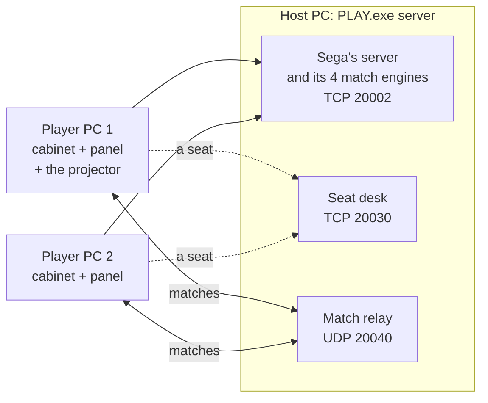

<p align="center">
  
</p>

<p align="center">
  <a href="https://github.com/Forza-WCCF/WCCF-Kit-1011/actions/workflows/kit.yml"></a>
  
  
  
</p>

**World Club Champion Football: Intercontinental Clubs 2010-11** on a Windows PC: Sega's arcade server, the projector (the shared big screen) and a player cabinet on one PC, or many PCs playing on one server. Around the game's picture sits a panel with the cabinet's buttons, your cards and your club.

> **The kit holds none of Sega's files.** Everything that comes from the game is made by SETUP from your own copy.

## What you get

| | |
|---|---|
| **The whole arcade on one PC** | PLAY starts the server, the projector and seat 1 together; only two windows open |
| **Formation board** | your cards on the table: drag to move, drop on another card to swap, right-click to take one off |
| **Catalogue** | all 3,909 player cards: search, position and rarity filters, sorting, a slider per stat |
| **Keys** | choose your own keys, or a game controller's buttons |
| **Club card** | your club as the game reads it, more than one club, safe saves with backups, CLEAR BAD ENDINGS |
| **English** | about 7,200 lines of screen text, the players' names, money in dollars, built from your own game files |
| **Online play** | one PC hosts, the others join; matches between players go through the host, so nobody installs anything else |

## Quick start

1. **You need** Windows 10 or 11 (64-bit), the community's Rev D download (its "sbwg" zip, unzipped to a folder called `extracted`) and DirectX 9 (Microsoft's June 2010 runtime; SETUP tells you if it is missing).
2. **Unzip the kit** into a folder of its own.
3. **Drag the `extracted` folder onto `SETUP.exe`.** It checks your copy, sets it up and makes the card catalogue (about a minute).
4. **Double-click `PLAY.exe`.** Click the cabinet's window and play with the keyboard. To quit, close the game's window.
5. Optional: **`ENGLISH.exe`** puts the game into English.

Everything else, including every key, setting and panel, is in [README.txt](/README.txt), the guide that comes with the kit.

## Play online

```text
PLAY.exe server                  on the PC that hosts: the server only, in the background
PLAY.exe remote 192.168.1.20     on each player's PC, with the host's address
```

- The host lets in **TCP 20002 and 20030** and **UDP 20040** (at home behind a router: forward them to the host).
- The first PC to join also shows the **projector**.
- The host can play too: `PLAY.exe remote` with its own local address.



## For developers

Git holds the source; GitHub builds the programs and the kit zip.

| Script | Does |
|---|---|
| `source\build.ps1` | builds every program: the hook, the panel and the helpers (C, 32-bit MSVC) and PLAY, SETUP and ENGLISH (Rust) |
| `source\check.ps1` | the checks that need no game: scripts, key driver, panel self-tests, club card, quitting |
| `source\package.ps1` | the kit zip in `dist\`, exactly as players get it |

You need Visual Studio 2022 (or its Build Tools) with "Desktop development with C++", and rustup. Every push and pull request runs all three on GitHub ([kit.yml](/.github/workflows/kit.yml)). A `kit-*` tag drafts a release with the zip; it is played in the real game before it is published. Changes go in through pull requests; see [CHANGELOG.md](/CHANGELOG.md).

---

<p align="center">Made by the WCCF community: <a href="https://github.com/flack0x">flack0x</a> and <a href="https://github.com/peakxl">peakxl</a>, Forza-WCCF</p>
